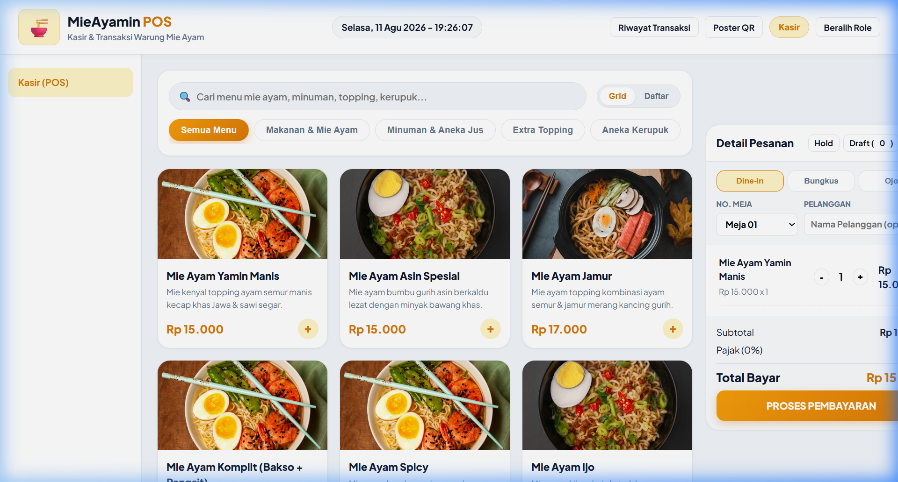
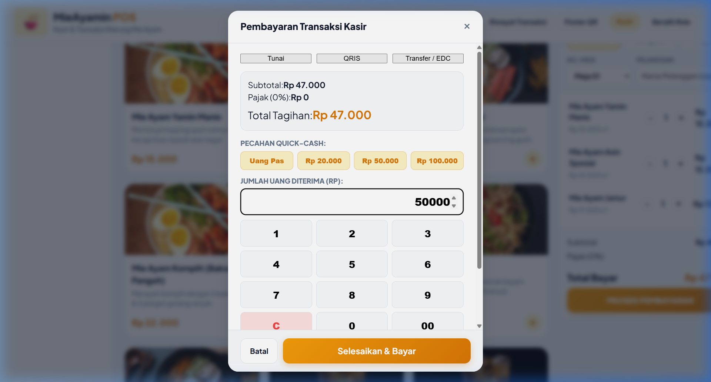
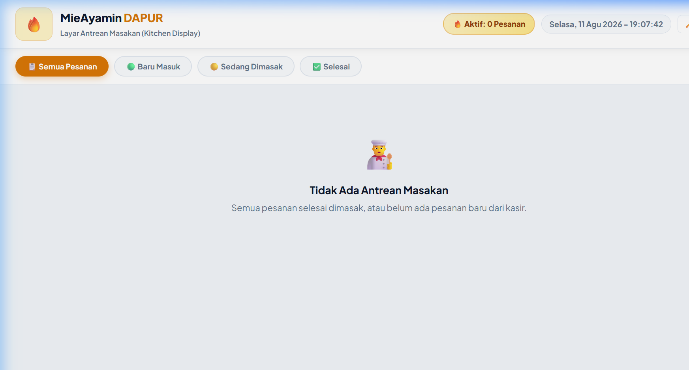
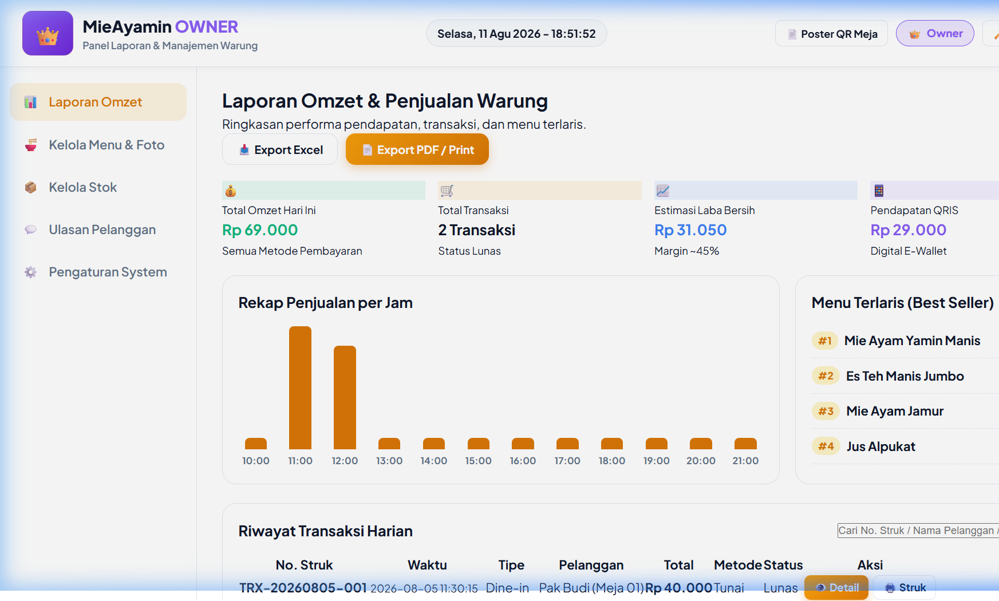

# 🍜 MieAyamin POS — System Documentation & Developer Guide

Selamat datang di repositori resmi **MieAyamin POS**, sistem Point of Sale (Kasir), Kitchen Display System (KDS), dan Admin Dashboard Operasional Warung Mie Ayam modern berbasis **Web Native (HTML5, Vanilla CSS3, JavaScript ES6+, & Web LocalStorage API)**.

Aplikasi ini bersifat **offline-first**, cepat, responsif, dan tidak membutuhkan dependensi server/database backend eksternal.

---

## 📸 Tangkapan Layar Aplikasi (App Screenshots)

### 1. Mode Kasir (Point of Sale — POS)
Halaman utama pencatatan pesanan dengan filter kategori menu (`Makanan & Mie Ayam`, `Minuman & Aneka Jus`, `Extra Topping`, `Aneka Kerupuk`), switch tampilan Grid/Daftar, fitur Hold/Draft pesanan, dan kalkulasi total otomatis.



---

### 2. Modal Pembayaran & Kembalian Real-Time
Modal checkout serbaguna yang mendukung metode pembayaran **Tunai**, **QRIS**, dan **Transfer / EDC**. Dilengkapi pecahan Quick-Cash (`Uang Pas`, `20rb`, `50rb`, `100rb`), Touch Numpad Grid, dan kalkulasi uang kembalian real-time.



---

### 3. Mode Dapur (Kitchen Display System — KDS)
Layar antrean masakan real-time untuk area dapur dengan indikator warna urgensi masakan (🟢 Hijau `<5m`, 🟡 Kuning `5–10m`, 🔴 Merah Pulse `>10m urgent`), live timer ticker, notifikasi suara antrean baru, dan status toggle.



---

### 4. Mode Owner & Admin Dashboard
Panel bisnis yang dilindungi **PIN Keamanan Owner (Default: `9999`)**. Dilengkapi analisis omset harian, grafik penjualan per jam, peringkat Top Best Seller, **Full CRUD Kelola Katalog Menu & Foto**, serta **Full CRUD Stok Bahan Baku**.



---

## 🛠️ Teknologi & Arsitektur Sistem (Tech Stack)

- **Frontend**: Native HTML5, Vanilla CSS3 (Custom Design System Amber Gold Theme), JavaScript (ES6+ Native Vanilla)
- **State & Storage**: Browser `window.localStorage` API (`STORAGE_KEY: mieayamin_pos_v2_data`)
- **Sound Effect**: Web Audio API Synthesizer (Chime sound effect tanpa file audio external)
- **Offline Server**: Compatible dengan `npx serve`, Live Server, Nginx, atau Apache static hosting.

---

## 📂 Struktur Direktori Project

```
c:\GALERI\POS MieAyamin/
├── index.html           # Landing Page & Layar Utama Kasir (POS)
├── kasir.html           # Workspace Kasir POS
├── dapur.html           # Layar Antrean Dapur (Kitchen Display System)
├── admin.html           # Dashboard Owner & Admin (Omset, Stok, & Menu CRUD)
├── poster_qr.html       # Printable Poster QR Code Ulasan Pelanggan Meja
├── dokumentasi.html     # Halaman Web Printable Dokumentasi Resmi PDF
├── README.md            # Dokumentasi Repositori GitHub Ini
├── styles.css           # Fallback Design System Stylesheet Root
├── css/
│   └── styles.css       # Master Design System CSS (Amber Gold Tokens & Layouts)
├── js/
│   ├── storage.js       # Shared State Manager, LocalStorage API, & Web Audio Synthesizer
│   ├── kasir.js         # Logika Transaksi Kasir, Cart, Hold/Draft, & Checkout Payment
│   ├── dapur.js         # Logika Antrean Dapur KDS, Live Timer, & Notif Suara
│   └── admin.js         # Logika Analytics Omset, Kelola Stok, & Kelola Menu CRUD
└── images/              # Aset Foto Produk & Screenshots Aplikasi (PNG)
    ├── mie_yamin_manis.png
    ├── mie_ayam_komplit.png
    ├── es_teh_jumbo.png
    ├── es_jeruk_peras.png
    ├── ss_kasir.png
    ├── ss_payment.png
    ├── ss_dapur.png
    └── ss_admin.png
```

---

## 🚀 Cara Menjalankan Aplikasi Secara Lokal

### Syarat Prasyarat:
- Node.js (opsional, untuk menjalankan lokal dev server) ATAU cukup buka file `index.html` langsung di web browser apa pun (Google Chrome / Microsoft Edge / Safari / Firefox).

### Langkah Menjalankan:
1. Clone repositori ini:
   ```bash
   git clone https://github.com/USERNAME/REPO_NAME.git
   cd REPO_NAME
   ```
2. Jalankan server lokal:
   ```bash
   npx serve .
   ```
3. Buka di browser:
   👉 **`http://localhost:3000`**

---

## 🗄️ Skema Data LocalStorage (`mieayamin_pos_v2_data`)

Seluruh data transaksi dan stok tersimpan di browser via `window.localStorage`:

```json
{
  "cart": [
    {
      "id": "mie-1",
      "name": "Mie Ayam Yamin Manis",
      "unitPrice": 15000,
      "qty": 1,
      "image": "images/mie_yamin_manis.png"
    }
  ],
  "transactions": [
    {
      "id": "TRX-847291",
      "date": "12 Aug 2026",
      "time": "05:40",
      "table": "Meja 01",
      "customer": "Pelanggan Umum",
      "type": "Dine-in",
      "method": "Tunai",
      "total": 15000,
      "given": 50000,
      "change": 35000,
      "items": [...]
    }
  ],
  "kitchenOrders": [...],
  "draftOrders": [...],
  "stock": {
    "mie_basah": { "name": "Mie Basah Organik", "stock": 82, "unit": "porsi", "minStock": 20 }
  },
  "customMenu": [...]
}
```

---

## 💡 Panduan Penghentian & Pengembangan Masa Depan (Developer Guide)

### 1. Mengubah PIN Owner (Default: `9999`)
Buka file `js/admin.js` dan `js/kasir.js`, cari teks string `'9999'` dan ganti dengan PIN baru yang diinginkan.

### 2. Menambah / Mengedit Katalog Menu & Foto
Akses **Mode Owner (`PIN 9999`)** ➔ Buka tab **Kelola Menu & Foto** ➔ Gunakan tombol **`Tambah Menu Baru`**, **`Edit Detail`**, atau **`Hapus`** untuk manajemen penuh secara visual dari UI tanpa edit kode.

### 3. Menambah Kategori Menu Baru di POS
Tambahkan tombol kategori baru pada file `index.html` / `kasir.html`:
```html
<button class="cat-tab" data-cat="snack">Aneka Snack</button>
```
Lalu tambahkan produk baru dengan properti `cat: 'snack'` pada `DEFAULT_MENU` di `js/storage.js`.

---

## 📄 Lisensi
Hak Cipta &copy; 2026 MieAyamin POS System. Hak Cipta Dilindungi.
